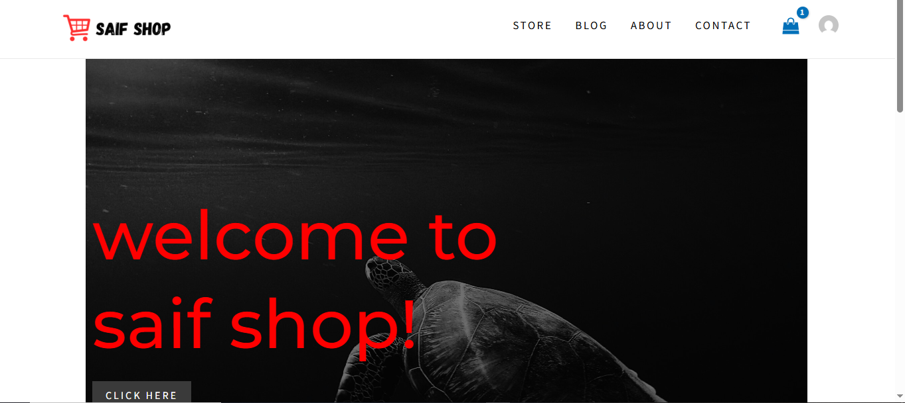
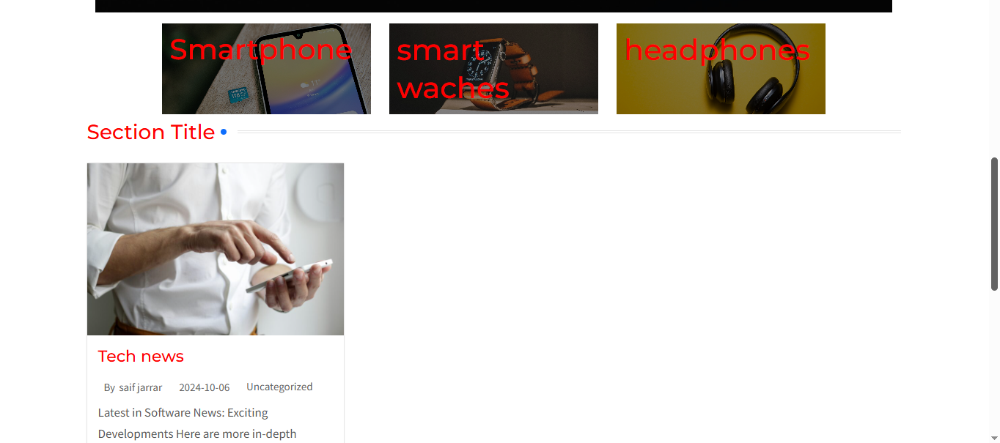
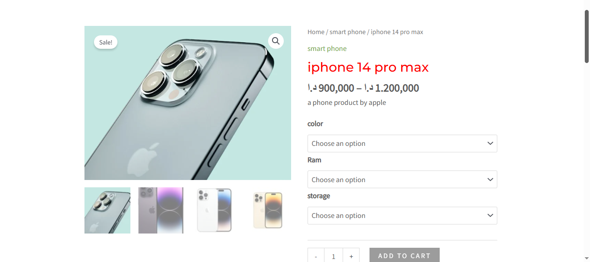
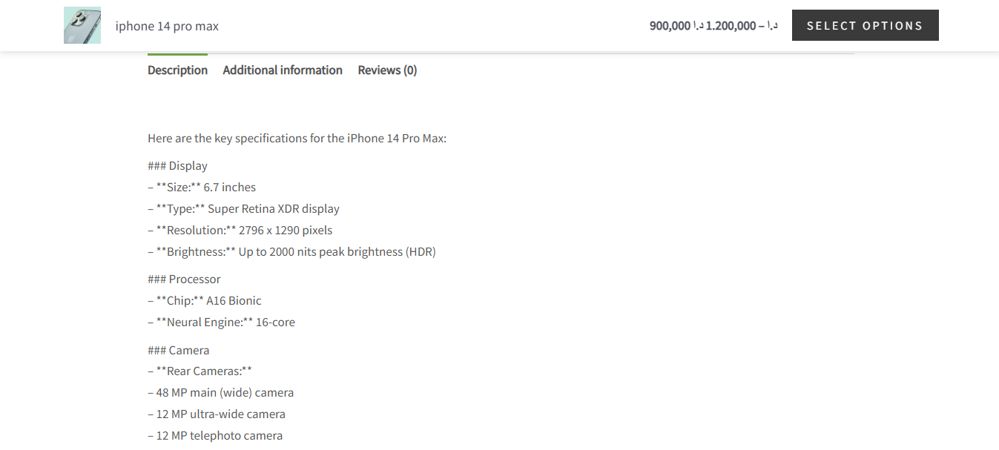
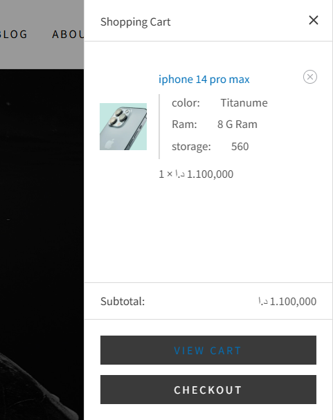

# Saif Shop — Electronics E-Commerce Website

A modern e-commerce website built with WordPress for selling and showcasing electronic products such as smartphones, smartwatches, and headphones.
link:https://dev-my-shop1.pantheonsite.io/

## Features

* Display of electronic products
* Product categories and organized listings
* Product pages with detailed information
* Shopping cart and checkout functionality
* PayPal payment integration
* Responsive website design
* Grid-based product display
* SEO optimization

## Technologies & Tools

* WordPress
* WooCommerce
* Elementor
* WooCommerce PayPal
* Post Grid
* Yoast SEO

## Project Description

Saif Shop is a WordPress-based e-commerce website designed to sell and showcase different electronic products, including smartphones, smartwatches, and headphones.

The website was built using WooCommerce for e-commerce functionality and Elementor for designing and customizing the website. PayPal was integrated as a payment method, while Post Grid was used to organize and display products in a grid layout.

Yoast SEO was also used to improve the website's search engine optimization and help optimize its content for search engines.

## Screenshots
## Screenshots

